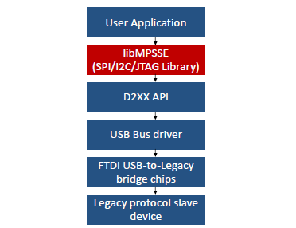
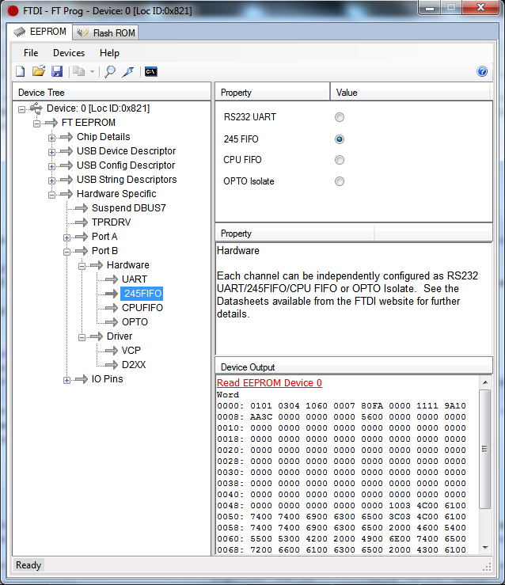
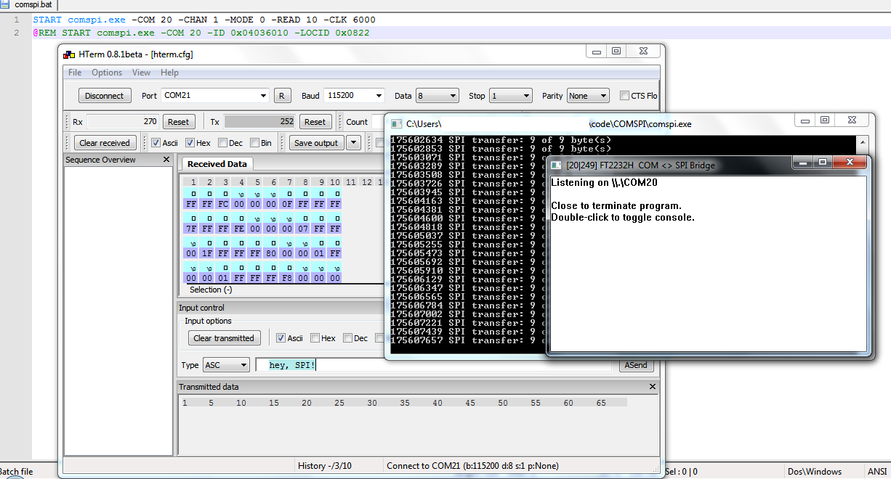

# COMSPI

A hardware developer utility that allows you to control an FT2232H - turned - SPI master through a serial connection. Send binary data, receive a matching number of bytes.

Once set up using FT\_PROG, an FTDI chip with one or more Multi-Protocol Synchronous Serial Engine ports can act as an SPI master USB peripheral, which at its core would otherwise  involve the use of libMPSSE or its higher-level wrappers, like libMPSSE\_SPI.

A particularly convenient way to use COMSPI during the development von SPI slave devices turned out to be defining `Sequences` in HTerm - with both HTerm and COMSPI connected through a com0com bridge.

##  Setup

You'll need an FTDI device that features one or more MPSSE ports (FT2232H or similar).

Download / install the the following applications and drivers:
	
<ul>
	<li> <a href="http://www.ftdichip.com/Drivers/D2XX.htm">FTDI D2XX device driver</a>
	<li> FT_PROG from the <a href="http://www.ftdichip.com/Support/Utilities.htm">FTDI Utilities</a> section (as of writing: Rev. 2.8.2), you will need this tool to select "245 FIFO" mode and the "D2XX" driver for individual MPSSE ports 
	<li> Serial Port null-modem bridge: <a href="http://sourceforge.net/projects/com0com/files/com0com/2.2.2.0/">com2com Rev. 2.2.2 or newer.</a> 
		(current version with signed drivers)
	<li> a serial port terminal like <a href="http://www.heise.de/download/hterm.html">HTerm</a>
</ul>

Find your device and read its EEPROM. For a given `Port`, select

* Hardware: 245FIFO
* Driver: D2XX

Subsequently, write back the updated configuration.

It may be necessary to deactivate the VCP driver in `devmgmt.msc` for a given port that has already been installed and won't go away even when the FT\_PROG tool has been used to change the driver mode. I guess that is because The Vendor ID: Product ID of the enumerated USB device is already registered and drivers are loaded.

## Use

The following parameters are currently supported:

<table>
<tr>
	<td> <b>COMSPI flag </b> </td>   <td> &emsp;<b>mandatory? </b></td> <td> <b>&emsp;default value</b> </td> <td> <b> &emsp;description </b> </td>
</tr>
<tr>
	<td>-COM</td>	<td>yes</td> 	<td>-</td> <td>com0com virtual COM port to connect to</td>
</tr><tr>
	<td>-CHAN</td>	<td>yes *)</td> 	<td>-</td> <td>an available MPSSE channel. Start COMSPI without parameters to get an enumeration.</td>
</tr><tr>
	<td>-ID</td>	<td>yes **)</td> 	<td>-</td> <td>VID:PID identifier (see enumeration), e.g. 0x04036010. You can also modify these values in FT_PROG.</td>
</tr><tr>
	<td>-LOCID</td>	<td>yes **)</td> 	<td>-</td> <td>see -ID, e.g. 0x0821</td>
</tr><tr>
	<td>-MODE</td> 	<td></td> 		<td>0</td> <td>one of {0, 1, 2, 3}. See <a href="http://www.ftdichip.com/Support/Documents/AppNotes/AN_178_User_Guide_For_LibMPSSE-SPI.pdf">AN178</a>, Mode1 and Mode3 are not fully functional</td>
</tr><tr>
	<td>-CSEL</td> 	<td></td> 		<td>active low (0)</td> <td>one of {0,1}, "0" for Active Low mode</td>
</tr><tr>
	<td>-READ</td> 	<td></td> 		<td>1 (Byte)</td> <td>number of bytes to be read after a write operation</td>
</tr><tr>
	<td>-CLK</td> 	<td></td> 		<td>5000 (Bit/s)</td> <td>serial clock speed in bit/sec.</td>
</tr>
</table>
*), **) Note: you must either specify a channel (may vary with number of devices connected) or an -ID 0x... -LOCID 0x... pair. to identify the channel to which to connect.

### Example

For use with FT2232H (VID 0x0403 PID 0x6010):

	@START comspi.exe -COM 20 -CHAN 1 -MODE 0 -READ 10 -CLK 6000
	@START comspi.exe -COM 20 -ID 0x04036010 -LOCID 0x0822

There is also a pair of numbers in the window title expressing | to show info when minimized.
To just send out data you may want to set -READ 0. 

* com0com COM20 \<-\> COM21
* MISO connected to a signal generator producing a square wave
* "hey, SPI!" -\> 9 bytes read back

## Links 
<ul>
	<li>the <a href="http://www.ftdichip.com/Support/SoftwareExamples/MPSSE/LibMPSSE-SPI.htm">libMPSSE-SPI</a> code and examples
	<li><a href="http://www.ftdichip.com/Support/Documents/AppNotes/AN_135_MPSSE_Basics.pdf">AN135: MPSSE Basics</a>
	<li><a href="http://gcc.gnu.org/">GCC</a> GNU compiler collection for g++
</ul>

